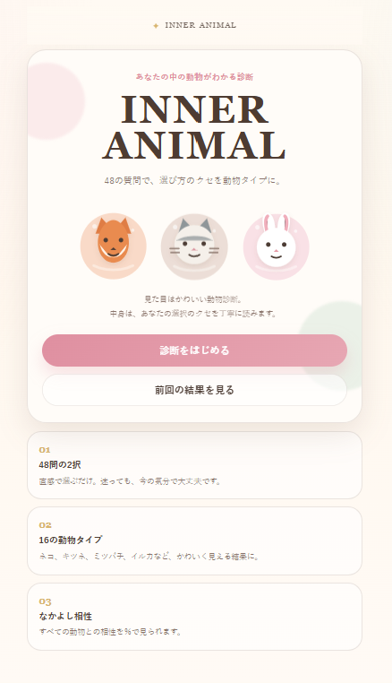
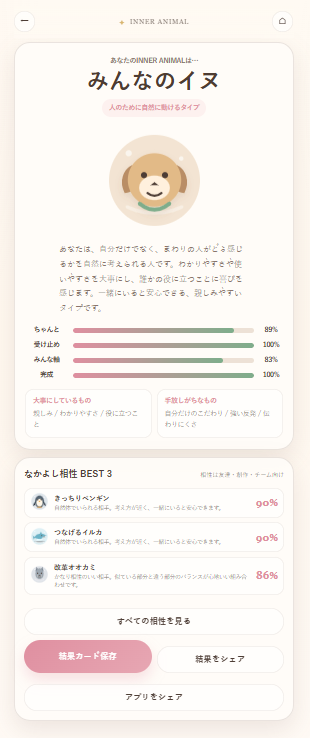

# INNER ANIMAL v1.17

48問の2択で、あなたの「選び方のクセ」をかわいい動物タイプにするPWAです。

## 実行画面

https://inner-animal.pages.dev/


## Screenshots

### screenshot1


### screenshot2


## できること

- 48問の2択診断
- 16種類のかわいい動物タイプ
- 16のアニマル一覧ページ
- 詳細な結果説明
- 4軸スコア表示
  - 雰囲気 / ちゃんと
  - 受け止め / 攻め
  - 自分軸 / みんな軸
  - 完成 / 伸びしろ
- なかよし相性 BEST 3
- 全15タイプとの相性％一覧
- 友達のタイプを選んで相性％を見る機能
- 結果カードPNG保存
- 結果シェア
- アプリシェア
- PWA対応

## タイプ一覧

| コード | 動物タイプ |
|---|---|
| ASIC | こだわりネコ |
| ASIB | やさしいシカ |
| ASOC | センスのハクチョウ |
| ASOB | ふんわりウサギ |
| ARIC | 深読みフクロウ |
| ARIB | 違和感キツネ |
| AROC | 攻めセンスのユキヒョウ |
| AROB | ひらめきラッコ |
| PSIC | きっちりペンギン |
| PSIB | こつこつミツバチ |
| PSOC | みんなのイヌ |
| PSOB | つなげるイルカ |
| PRIC | 隠れ攻めハリネズミ |
| PRIB | 即興タヌキ |
| PROC | 改革オオカミ |
| PROB | 突破リス |

## ローカル確認

そのまま `index.html` を開いて確認できます。PWA / Service Worker まで確認する場合は、ローカルサーバーで開いてください。

```bash
npx serve .
```

## Cloudflare Pages デプロイ

```bash
cd "$env:USERPROFILE\Desktop\inner-animal-pwa"
npx wrangler pages deploy . --project-name inner-animal
```

## GitHub Pages

静的ファイルだけで動くため、GitHub Pagesにもそのまま置けます。

## メモ

- AI APIは使っていません。
- 画像生成コストはかかりません。
- 動物イラストはアプリ内SVGです。
- 結果は端末内の localStorage に保存されます。


## v1.1 修正

- 「結果をシェア」は結果テキスト＋対応端末では結果カードPNGを共有するように修正。
- 「アプリをシェア」はアプリURL共有専用に分離。
- Service Worker のキャッシュ名を更新。


## v1.2 update

- 結果をシェアではURLを渡さず、対応端末では結果カードPNGのみを共有します。
- 画像共有非対応の環境では、結果カードを保存し、結果文をクリップボードへコピーします。
- アプリをシェアのみURL共有します。


## v1.3 更新内容

- 結果をシェアすると、アプリURLではなく結果復元用URLを共有します。
- 共有URLは `?result=コード&s=スコア` を含み、開くとそのまま結果画面を表示します。
- アプリをシェアは通常のトップURLのみを共有します。
- Service Worker キャッシュ名を更新しました。


## v1.5 update

- 「結果をシェア」ボタンでOS共有シートを直接開かず、結果専用URLを必ず画面表示するように変更。
- Windows / Edge の共有シートでクエリ付きURLがルートURLのように見える問題を回避。
- 結果URLは `?result=CODE&s=...` 形式で、開くと同じ結果画面が表示されます。
- Service Worker のキャッシュ名を更新。

## v1.6 update

- 質問画面の上部に「質問 7 / 48」のような大きな現在位置表示を追加
- 「あと 41 問」「これが最後の質問です」を表示
- 進捗バーを現在の質問数ベースに変更
- Service Worker のキャッシュ名を更新


## v1.7 update

- 「16のアニマルを見る」ページを追加
- TOPとRESULTから16タイプ一覧へ移動可能
- 各アニマルカードに軸情報と「詳しく見る」を追加
- 結果画面に「詳しい診断」を追加
  - 選び方のクセ
  - 強み
  - 気をつけたいこと
  - 伸ばすと良いところ
- 結果があっさりしすぎないように、16タイプ全てに詳細文を追加
- Service Worker のキャッシュ名を更新

## v1.8 update

- 共有された結果URLを開いた人向けに「自分も診断する」ボタンを追加
- 結果シェア文に「あなたも診断してみてください」を追加
- Service Workerキャッシュ名を更新

## v1.9 update

- READMEに `screenshot1.png` / `screenshot2.png` を追記
- GitHub表示用にルート直下へ `screenshot1.png` / `screenshot2.png` を追加
- PWA manifest用に `assets/screenshots/` にも同じスクリーンショットを追加


## v1.13 PWA修正

- manifest の `start_url` / `scope` / `id` をルート基準に修正
- Service Worker の登録を `/sw.js` + `scope: '/'` に修正
- オフライン時も結果URLなどのナビゲーションで `index.html` にフォールバック
- ホーム画面に「アプリをホーム画面に追加」ボタンを追加
- iOS / Android / PC でインストール方法が分かる案内を追加

### Cloudflare Pages デプロイ注意

最初に production branch を `inner-animal` で作成している場合は、以下でデプロイしてください。

```powershell
npx wrangler pages deploy . --project-name inner-animal --branch inner-animal
```

production branch を `main` に変更済みの場合のみ、`--branch main` を使ってください。

## v1.13 update

- 結果カード画像を上品でかわいいデザインに再調整
- シェアカード内の動物表示を、より親しみやすい絵文字ベースに変更
- 相性BEST3の表示を読みやすく整理
- シェアカード下部に「あなたも診断」導線を追加
- Service Workerキャッシュ名更新


## v1.14 更新

- 結果画面とシェアカードの動物絵をアプリ内のシンプルなSVGスタイルへ統一
- 16アニマル詳細でも、全タイプが58%になる問題を修正
- グラフ値をタイプ別の自然なプロファイルに変更
- 90%台連発・48%固定のような極端すぎる表示を抑制
- PWAインストール画面で未使用のコンセプトボード画像が出ないよう、manifest screenshots を削除
- Service Worker キャッシュ名を v1.14 に更新


## v1.17 update

- 結果画面に **TYPE CODE（ASIB / ARIB など）** を追加
- 4文字コードの意味を **Atmosphere / Safe / Inner / Becoming** のように表示
- グラフを単独バーから **左右比較グラフ** に変更
  - 例：雰囲気 76%｜24% ちゃんと
- 16アニマル詳細・結果画面を、MBTI的に方向性が読める形式へ調整
- 結果シェアカードにも TYPE CODE と左右比較バランスを反映
- Service Worker キャッシュ名を v1.17 に更新
